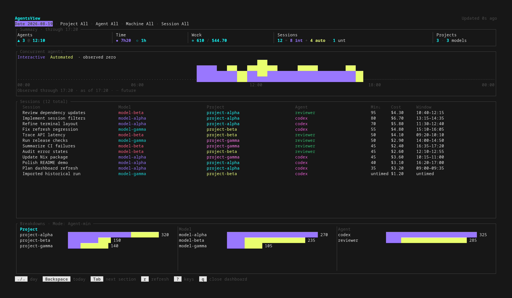

# herdr-agentsview

<!-- HTML is required because GitHub Markdown has no image-sizing syntax. -->
<!-- markdownlint-disable-next-line MD033 -->


AgentsView activity, compressed into one very busy terminal.



The screenshot is synthetic. Try the same isolated dashboard without an
AgentsView or Herdr setup:

```console
nix run .#demo
```

## Real Setup

Build the plugin and link its generated manifest into Herdr:

```console
herdr plugin link "$(nix build --no-link --print-out-paths .#herdr-agentsview)/share/herdr/plugins/local-agentsview"
herdr plugin config-dir local.agentsview
```

Create `config.toml` in the printed directory:

```toml
api_base_url = "https://agentsview.example.com/"
request_timeout_seconds = 10
refresh_interval_seconds = 60
timezone = "Etc/UTC"
```

Expose exactly one of `AGENTSVIEW_TOKEN` or `AGENTSVIEW_TOKEN_FILE` to the
environment that starts Herdr. Keep the credential out of the config file and
the Nix store. From a Herdr pane, open the dashboard with:

```console
herdr plugin action invoke open --plugin local.agentsview
```

For a configured standalone terminal, set `HERDR_PLUGIN_CONFIG_DIR` to the
directory containing `config.toml`, expose the same runtime token, and run
`nix run . -- tui`.

## Platforms

x86_64 Linux, aarch64 Linux, and aarch64 macOS.

## Dependency Updates

Renovate runs weekly and can also be started manually. Before the workflow's
first run, create an expiring fine-grained personal access token scoped only to
this repository and save it as the `RENOVATE_TOKEN` Actions secret. Grant the
repository permissions Renovate documents for a fine-grained token:

- Commit statuses, contents, issues, pull requests, and workflows: read and write
- Dependabot alerts: read-only

For an organization-owned token, also grant read-only Members permission. No
GitHub App or repository setting change is required.

## Keys

- `Tab` / `Shift-Tab`: move focus
- arrows: move through dates, rows, choices, and timeline buckets
- `Backspace`: clear the focused filter or return the date to today
- `Enter`: apply a choice or toggle the focused timeline session slice
- `s` / `b`: show sessions or breakdowns in a narrow terminal
- `p` / `m` / `a`: choose project, model, or agent breakdowns
- `r`: refresh; `?`: help; `q`: quit
